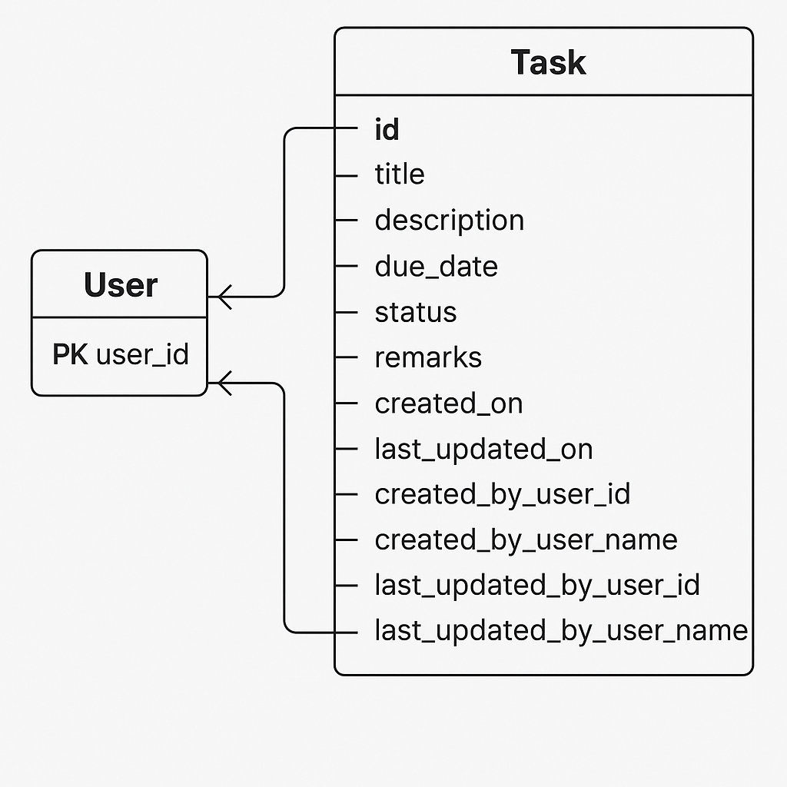

# Task Management System

## Overview
This is a Task Management application built for the Oritso Private Limited screening assignment.  
It allows users to Create, Read, Update, Delete (CRUD) and Search tasks using a ReactJS frontend, .NET backend, and MySQL database.

---

## 2. Features  
- User-friendly interface to manage tasks efficiently.  
- Perform CRUD operations on tasks with real-time updates.  
- Search tasks by title or status.  
- Track task deadlines with due dates.  
- Maintain audit trail with created and updated user details.  
- Responsive design for desktop and mobile views.


  
## 3. Technologies Used  
| Technology       | Purpose                  |
|------------------|--------------------------|
| ReactJS (v18+)   | Frontend SPA development |
| .NET Core 6      | Backend API development  |
| MySQL 8          | Database management      |
| Entity Framework | ORM for DB interactions  |
| Axios            | HTTP client for frontend |
| Tailwind CSS     | Styling and layout       |
| Visual Studio 2022 / VS Code | Development IDEs |
## Database Design

### ER Diagram


- **Task Table**  
  - `id` (Primary Key)
  - `title` (VARCHAR)
  - `description` (TEXT)
  - `due_date` (DATETIME)
  - `status` (ENUM or VARCHAR)
  - `remarks` (TEXT)
  - `created_on` (TIMESTAMP)
  - `last_updated_on` (TIMESTAMP)
  - `created_by_user_id` (INT)
  - `created_by_user_name` (VARCHAR)
  - `last_updated_by_user_id` (INT)
  - `last_updated_by_user_name` (VARCHAR)

### Data Dictionary

| Field Name | Data Type | Description |
|:-----------|:----------|:------------|
| id | INT (Primary Key) | Unique identifier for each task |
| title | VARCHAR(255) | Title of the task |
| description | TEXT | Description of the task |
| due_date | DATETIME | Deadline for the task |
| status | VARCHAR(50) | Status (Pending, Completed, In Progress) |
| remarks | TEXT | Additional remarks |
| created_on | TIMESTAMP | Record creation time |
| last_updated_on | TIMESTAMP | Record last update time |
| created_by_user_id | INT | ID of the creator |
| created_by_user_name | VARCHAR(255) | Name of the creator |
| last_updated_by_user_id | INT | ID of the person who updated |
| last_updated_by_user_name | VARCHAR(255) | Name of the person who updated |

### Indexes Used
- Primary Key Index on `id`
- Index on `due_date`
- Index on `status`

### Code First or DB First?
- **Approach Used:** DB First  
- **Reason:**  
  - MySQL database structure was defined first to clearly model real-world task properties.  
  - Backend code (Entity Models) was generated based on existing DB schema.
  -The database schema was designed upfront in MySQL to model real-world task properties clearly. Backend entity models and context classes were then generated based on this schema, ensuring tight coupling between the database and codebase.

---

## 5. Application Structure

### 5.1 Application Type  
- Single Page Application (SPA) using ReactJS on the frontend.  
- Backend implemented as a RESTful .NET Core Web API.  
- Frontend communicates with backend APIs asynchronously for CRUD and search operations.

### 5.2 Frontend Structure  
- ReactJS (version 18+) framework with component-driven architecture.  
- Pages and components include:  
  - Task List with search/filter functionality  
  - Task Creation form  
  - Task Update form  
  - Task Detail view  
  - Delete confirmation modal  

### 5.3 Backend Structure  
- API Endpoints:  
  - `POST /api/tasks` — Create task  
  - `GET /api/tasks` — Get all tasks  
  - `GET /api/tasks/{id}` — Get task by ID  
  - `PUT /api/tasks/{id}` — Update task  
  - `DELETE /api/tasks/{id}` — Delete task  
  - `GET /api/tasks/search?query=xyz` — Search tasks by title/status  

- Layers:  
  - Controller — handles HTTP requests  
  - Service — business logic layer  
  - Repository — data access layer  
  - Entity/Model — data models matching DB tables  
  - Database Context — EF Core DB context  

---


## Build & Installation

### Environment Details
- .NET 6
- Node.js 18+
- React 18+
- MySQL 8+
- Visual Studio 2022 / VS Code

### Backend Setup (DotNet)
```bash
cd backend
dotnet restore
dotnet build
dotnet run
```

## Frontend end Setup (React js)

### Prerequisites
- Node.js (v18+)
- npm (v9+)

### Steps to Run Frontend
```bash
# Navigate to frontend directory
cd frontend

# Install all dependencies
npm install

# Start the development server
npm run dev

```
## Database Setup (Mysql)

-- Create the database
CREATE DATABASE task_management;

-- Use the database
USE task_management;
```
-- Create the tasks table
CREATE TABLE tasks (
  id INT AUTO_INCREMENT PRIMARY KEY,
  title VARCHAR(255) NOT NULL,
  description TEXT,
  due_date DATETIME,
  status VARCHAR(50),
  remarks TEXT,
  created_on TIMESTAMP DEFAULT CURRENT_TIMESTAMP,
  last_updated_on TIMESTAMP DEFAULT CURRENT_TIMESTAMP ON UPDATE CURRENT_TIMESTAMP,
  created_by_user_id INT,
  created_by_user_name VARCHAR(255),
  last_updated_by_user_id INT,
  last_updated_by_user_name VARCHAR(255)
);
```

## Database Confrigation

```
"ConnectionStrings": {
  "DefaultConnection": "Server=localhost;Database=task_management;User Id=root;Password=yourpassword;"
}
```
